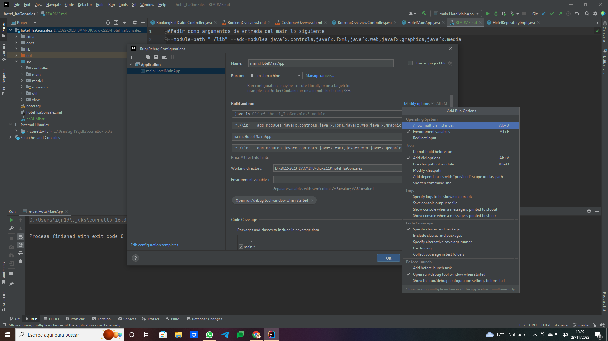

# HOTEL de Isa González

## Puesta en marcha de la aplicación
Para que arranque sin problemas la aplicación del hotel, hay que añadir como argumentos de entrada del main lo siguiente (VM Options):
--module-path "./lib" --add-modules javafx.controls,javafx.fxml,javafx.web,javafx.graphics,javafx.media

Mirar imagen para ver cómo tiene que estar antes de arrancar.

## Javadoc y Diagramas
El Javadoc se puede consultar, una vez abierta la aplicación, pulsando en la barra de menú la opción "Aplicación" > "Ver Javadoc".

Los diagramas de secuencia y el de casos de uso están en la carpeta "docs/diagrams" dentro del propio proyecto.